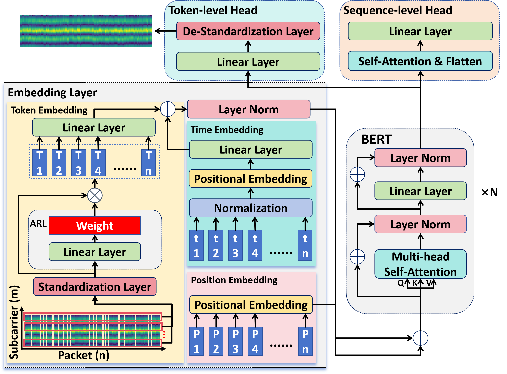
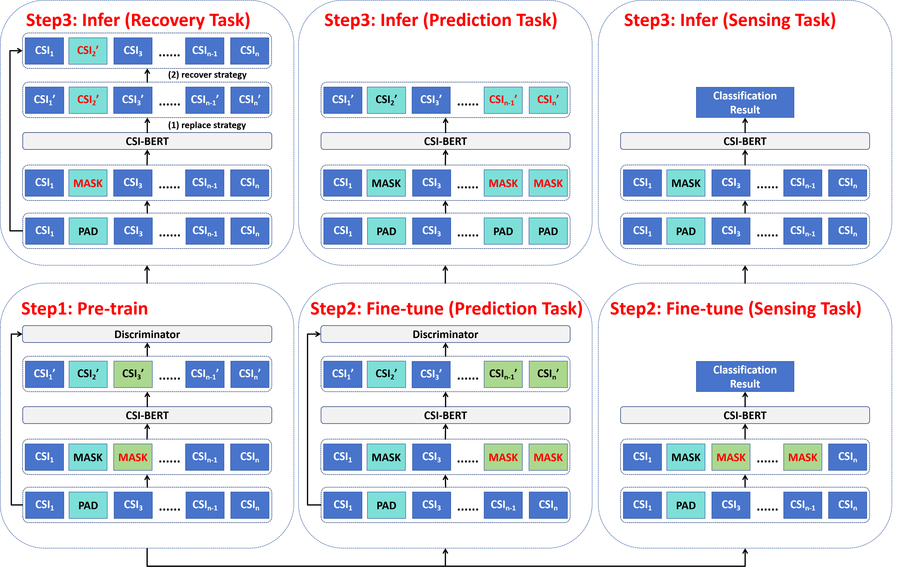

# CSI-BERT2

**Article:** Zijian Zhao, Tingwei Chen, Fanyi Meng, Hang Li, XiaoYang Li, Guangxu Zhu*, "CSI-BERT2: A Universal Model for CSI Time Series Application in ISAC", under way

The code is based on [CSI-BERT1](https://github.com/RS2002/CSI-BERT) ([article](https://arxiv.org/pdf/2403.12400)).




## 1. Data

### 1.1 Dataset

Public Dataset: [WiGesture](https://paperswithcode.com/dataset/wigesture), WiFall

Proposed Dataset: WiCount (./WiCount)


### 1.2 Data Preparation

Refer to [RS2002/CSI-BERT: Official Repository for The Paper, Finding the Missing Data: A BERT-inspired Approach Against Package Loss in Wireless Sensing (github.com)](https://github.com/RS2002/CSI-BERT)


## 2. Train




### 2.1 Pre-train

```shell
python pretrain.py --GAN --data_path <data path>
```

If you do not want to use the discriminator, you can delete the `--GAN`, it keeps the same in the following.


### 2.2 Fine-tune

#### 2.2.1 CSI Prediction Task

```shell
python prediction.py --GAN --data_path <data path> --parameters <fold path of the whole pre-trained models>
```


#### 2.2.2 CSI Sensing Task

```shell
python finetune.py --data_path <data path> --class_num <class num> --task <task name> --path <parameter path of the backbone> --mode <mode>
```

The mode can be set as 0, 1, or 2, corresponding to three experiments in our paper:
0: Training Set (100Hz), Testing Set (100Hz)
1: Training Set (100Hz+50Hz), Testing Set (100Hz+50Hz)
2: Training Set (100Hz), Testing Set (50Hz)

You can also change the `gap` parameter in `load_data_random` function to get more sampling rate.


The task name can be set as "action", "fall", or "people", representing different tasks when using different datasets:
WiGesture: action (gesture recognition), people (people identification)
WiFall: action (action recognition), fall (fall detection), people (people identification)
WiCount: people (people number estimation)


### 2.3 Infer

#### 2.3.1 CSI Recovery Task

```shell
python recover.py  --data_path <data path> --parameters <parameter path of the pre-trained recoverer>
```


#### 2.3.2 CSI Prediction Task

```shell
python prediction.py  --data_path <data path> --parameters <fold path of the whole pretrained models> --eval_percent <the percentage of CSI sequence to be predicted>
```

 

### 3 Notice

The current version of our code does not support multiple GPUs. Please specify only one GPU or fix the relevant code. We would appreciate if you could share the code that can solve this problem.

#### 